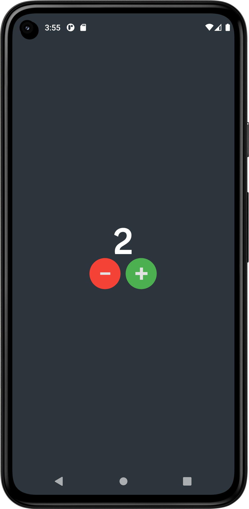
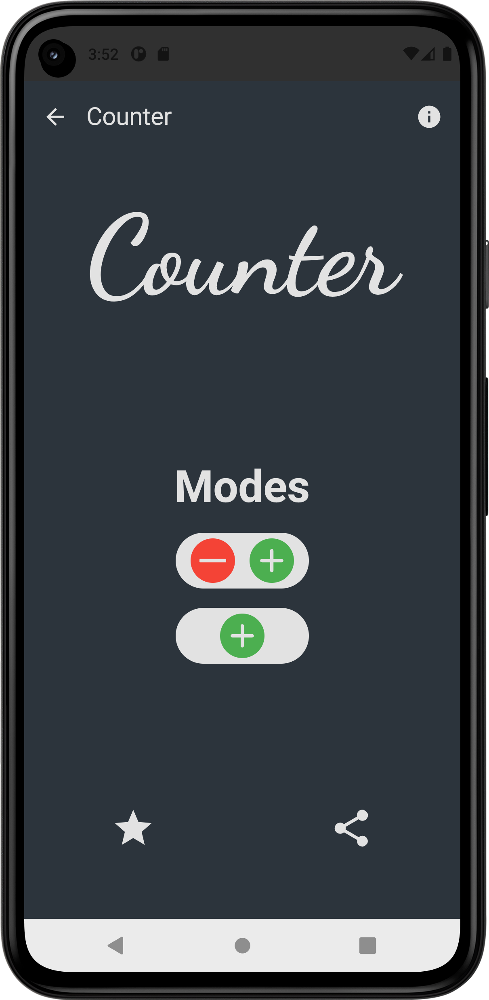
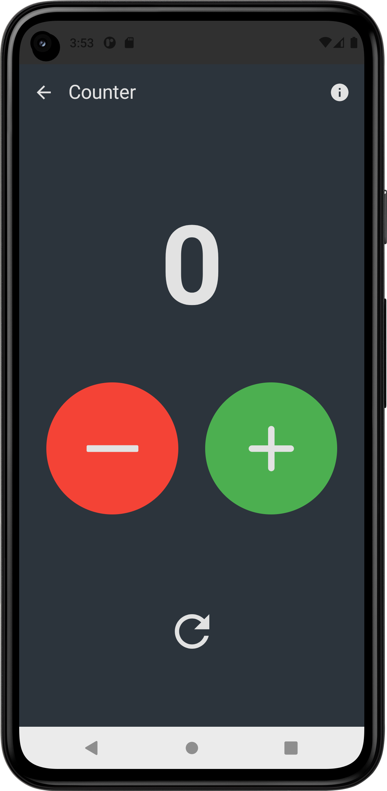
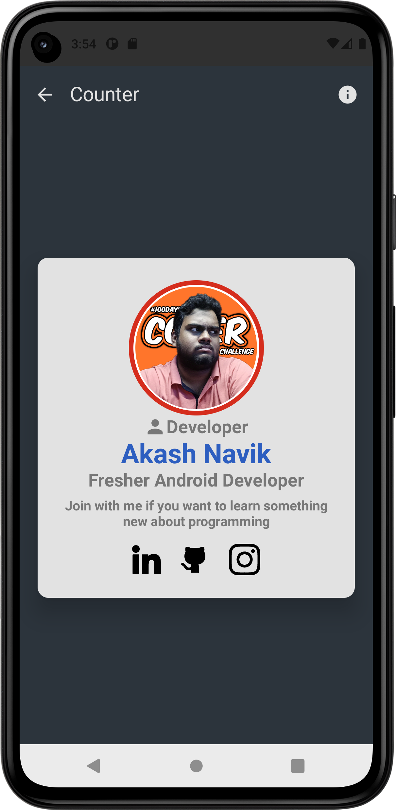

</head>
<body>
    <h1>Counter App</h1>
    
The Counter App is a simple Android application that allows users to increment, decrement, and reset a counter. The app features persistent storage to ensure that the counter value is saved and restored even after the app is closed or the device is restarted.
Features</h2>
    <ul>
        <li><strong>Increment/Decrement Buttons:</strong> Increase or decrease the counter value with intuitive buttons.</li>
        <li><strong>Reset Functionality:</strong> Reset the counter to zero with a dedicated button.</li>
<!--         <li><strong>Persistent Storage:</strong> Counter value is saved and restored after closing or restarting the app.</li> -->
        <li><strong>Modern UI:</strong> Built with Jetpack Compose for a responsive and sleek interface.</li>
<!--         <li><strong>Customizable Settings:</strong> Adjust button colors and counter values according to user preferences.</li> -->
    </ul>
    <h2>Technology Stack</h2>
    <ul>
        <li><strong>Jetpack Compose:</strong> For building the user interface.</li>
    </ul>
    <h2>Getting Started</h2>
    <h3>Prerequisites</h3>
    <ul>
        <li>Android Studio</li>
        <li>Basic knowledge of Android development and Kotlin</li>
    </ul>
    <h3>Clone the Repository</h3>
    <pre><code>git clone https://github.com/AkashNavik/Conuter.git</code></pre>
    <h3>Build and Run</h3>
    <ol>
        <li>Open the project in Android Studio.</li>
        <li>Sync Gradle and build the project.</li>
        <li>Connect your Android device or start an emulator.</li>
        <li>Run the app by clicking on the 'Run' button in Android Studio.</li>
    </ol>
    <h2>Usage</h2>
    <ul>
        <li><strong>Increment:</strong> Tap the "+" button to increase the counter value.</li>
        <li><strong>Decrement:</strong> Tap the "-" button to decrease the counter value.</li>
        <li><strong>Reset:</strong> Tap the "Reset" button to set the counter back to zero.</li>
    </ul>
    <h2>Application Perview </h2>
    
Perview Screen of Rock Paper Scissors Game:

    <ul>
        <li><h3>Splash Screen<h3> 
        
        </li>
        <li><h3>Main Screen </h3>
        
        </li>
        <li><h3>Mode Screen </h3>
          
        </li>
        <li><h3> My Info Screen </h3>
            
        </li>
    </ol>
    <h2>Contact</h2>
    
If you have any questions or need further assistance, please contact <strong>Akash Navik</strong> at <a href="akashnavik05@gmail.com">@email</a>.
      Do CheckOut My Linked Profile <a href ="https://www.linkedin.com/in/akash-navik-38007617a/">Akash Navik</a>
    

</body>
